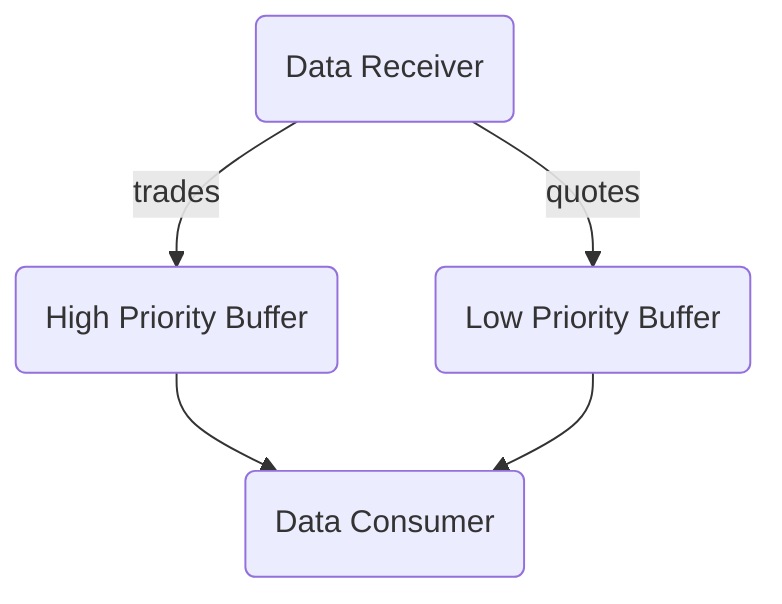

# Market Data Stream Processor

## Project Description

The goal of this project was to build a market data stream processor that efficiently handles real-time market data using concurrent processing and buffers.

It processes randomly generated quotes and trade executions, allowing for the calculation of portfolio values in real-time.

## Key Components

### Data Receiver

Simulates the reception of market data events from multiple sources. It generates random market data events at regular intervals and adds them to the appropriate buffer for further processing.

Two types of market data:

1. Quotes [low priority]
2. Trade executions [high priority]

### Buffer Implementation:

- High priority buffer: A thread-safe queue for trade executions.

  - The Producer enqueues, the Consumer dequeues.
  - ConcurrentQueue utilized for thread safety.

- Low priority buffer: A dictionary-based buffer for quotes.

  - The Producer maps new quotes to symbols, replacing existing ones if they haven't been read by the Consumer.
  - When the high priority buffer is empty, the Consumer reads all new quotes from the dictionary, then clears it.
  - A lock mechanism is employed to allow the Consumer to perform both operations without discarding new, unread quotes.

### Consumer

The Consumer component combines quote and trade data to calculate the price for each stock in the portfolio using a simple strategy. It follows these steps:

1. Upon receiving trade data for stock X, it sets the price of X to the trade price.

2. When a quote for stock X arrives:

- If there is a trade price on record, it sets the price of X as 0.8 times the last trade price plus the quote mid.
- If there is no trade price on record, it sets the price of X as the quote mid.

## Improvements

There isn't a dotnet standard library thread-safe priority queue. To enhance the system further, a custom one could be built. This enhancement would enable assigning higher priority to specific transactions, such as larger trades or trades associated with heavily weighted stocks in the portfolio.
