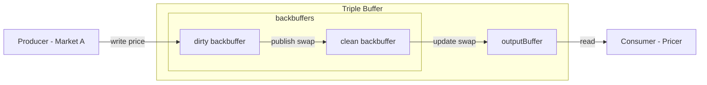
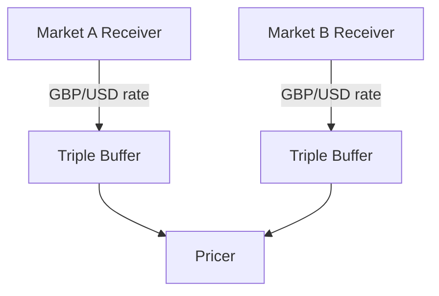

# Triple Buffer

## Project Description

Similar to the "Buffers" project. This project aims to build a market data stream processor that handles real-time market data. However, instead of using a queue shared between a single producer and single consumer, it uses a triple buffer, which avoids blocking behaviour.

F# works more naturally with an actor based concurrency model, therefore Java was used instead.

## The Triple Buffer

In the single producer and single consumer case, this approach has some useful characteristics:

1. The producer and consumer operate independently at their own rate and there is no blocking.
   - Producer can always write new data to the buffer.
   - Consumer can always read the latest (available) version of the data.
2. Bounded buffer size.
   - In queue case in the "Buffers" project, the (unbounded) queue could theoretically become very large due to processing rate discrepancies between the producer and consumer. Such behaviour could cause queue size to exceed the capacity of the processor's cache, causing performance issues.

Some other characteristics of a triple buffer (or reasons not to use one):

1. Data loss.
   - In the "Buffers" project, every executed trade was read and processed by the consumer.
   - In the triple buffer case, if the producer writes 2 values before the consumer reads, then the first (over-written) value will not be processed.
   - Not a concern for this project as we're only interested in getting the latest available price from the market.
2. Memory usage.
   - Three buffers use up more memory than one.
   - In this case the increase in performance due to the wait-free nature of a triple buffer justifies the memory overhead.

## Project Setup

